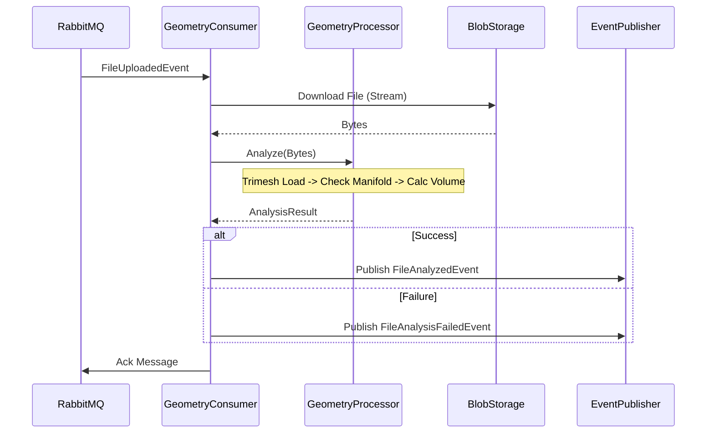

# Implementation Plan - Geometry Analysis Service

## Technical Context

### Technology Stack

- **Language:** Python 3.11+ (Strict Typing required)
- **Web Framework:** FastAPI (For Health Checks, Metrics, and Scalar Documentation)
- **Documentation:** `scalar-fastapi` (Accessible at `/geometry/scalar`)
- **Route Prefix:** All endpoints must be served under `/geometry` (e.g., `/geometry/liveness`).
- **Geometry Kernel:** `trimesh` (with `numpy` and `scipy` accelerated backends).
  - *Note:* For STEP support, include `gmsh` or `meshio` dependencies to facilitate BREP-to-Mesh tessellation.
- **Messaging:** `aio-pika` (Async RabbitMQ client)
- **Validation:** `Pydantic` v2
- **Storage Client:** `minio` or `google-cloud-storage` (Abstracted via `IStorageService`)
- **Testing:** `pytest` + `pytest-asyncio`

### Architecture & Data Flow



### Event Contracts (JSON Schemas)

#### 3.1 Incoming: `FileUploadedEvent`

```json
{
    "messageId": "uuid",
    "correlationId": "uuid",
    "payload": {
        "fileId": "uuid",
        "storageBucket": "uploads",
        "storageKey": "users/123/brackets/part_v1.stl",
        "contentType": "model/stl",
        "uploadedAt": "ISO8601"
    }
}
```

#### 3.2 Outgoing: `FileAnalyzedEvent`

```json
{
    "messageId": "uuid",
    "correlationId": "uuid", // MUST match incoming
    "payload": {
        "fileId": "uuid",
        "metrics": {
            "volumeCm3": 124.5,
            "surfaceAreaCm2": 450.2,
            "boundingBox": { "x": 100.0, "y": 50.0, "z": 20.0 },
            "isManifold": true,
            "eulerNumber": 2,
            "triangleCount": 15000
        },
        "processedAt": "ISO8601"
    }
}
```

### Internal Component Structure

#### `src/core/geometry.py`
- `GeometryProcessor` class.
- Method `analyze_stream(file_stream: BytesIO, file_extension: str) -> GeometryMetrics`.
- Uses `trimesh.load()` with force='mesh'.
- **STEP Support:** If extension is `.step` or `.stp`, perform tessellation (conversion to mesh) before analysis.
- **Critical:** Must run in a separate Thread or Process (via `run_in_executor`) to avoid blocking the Async Event Loop.

#### `src/consumers/upload_consumer.py`
- `RabbitMQConsumer` class using `aio-pika`.
- Handles message parsing, validation (Pydantic), and error handling (Nack/Requeue).

#### `src/infrastructure/storage.py`
- `StorageService` protocol/interface.
- Implementations for Local/S3/GCS.

## Constitution Check

### Core Principles

- **Library-First:** N/A (Service implementation)
- **CLI Interface:** N/A (Async Service)
- **Test-First:** Enforced via `pytest` and `pytest-asyncio` usage in plan.
- **Integration Testing:** Integration tests with local RabbitMQ planned in Phase 3.
- **Observability:** OpenTelemetry instrumentation required by specs (FR-011).
- **Simplicity:** Using `trimesh` leverages existing robust library rather than custom math.

### Compliance

- **Strict Typing:** `mypy` in CI.
- **Linting:** `ruff`.
- **Async:** All Network I/O must be async (`aio-pika`).
- **Error Handling:** Catch exceptions and publish `FileAnalysisFailedEvent` instead of crashing.

## Phase 0: Research

### Decisions

- **Geometry Kernel:** `trimesh` selected for robust mesh analysis and broad format support (STL/OBJ/STEP via extras).
- **Async Framework:** `aio-pika` + `FastAPI` (minimal) provides high-performance async I/O suitable for high-throughput messaging.
- **STEP Support:** Will require `gmsh` or similar installed in the container environment for `trimesh` to handle tessellation.

### Rationale

- Python is the industry standard for geometry processing (access to numpy/scipy ecosystem).
- Async I/O is critical for handling concurrent file downloads and message processing without blocking.

## Phase 1: Design & Contracts

### Data Model

- **Entities**: Defined in Spec (AnalysisRequest, GeometryMetrics, AnalysisResult).
- **Validation**: Pydantic models will strictly enforce schemas.

### Contracts

- **AsyncAPI**: `contracts/asyncapi.yaml` will be generated to define the messaging interface formally.

### Agent Context

- Will update agent context with Python/Trimesh specifics.

## Execution Phases

### Phase 1: Setup & Skeleton
- Initialize Python project (`pyproject.toml` with Poetry).
- Setup Dockerfile (multi-stage build to keep image small).
- Setup FastAPI health endpoints (`/geometry/liveness`, `/geometry/readiness`).

### Phase 2: The Math Core
- Implement `GeometryProcessor`.
- Unit Test with sample assets:
  - `cube.stl` (Known volume: 1000cm³) -> Assert Volume == 1000 +/- 0.1
  - `broken.stl` (Non-manifold) -> Assert isManifold == False

### Phase 3: Integration
- Implement `aio-pika` consumer.
- Implement Event Publisher.
- Integration Test: Publish dummy message to local RabbitMQ -> Verify output message appears.